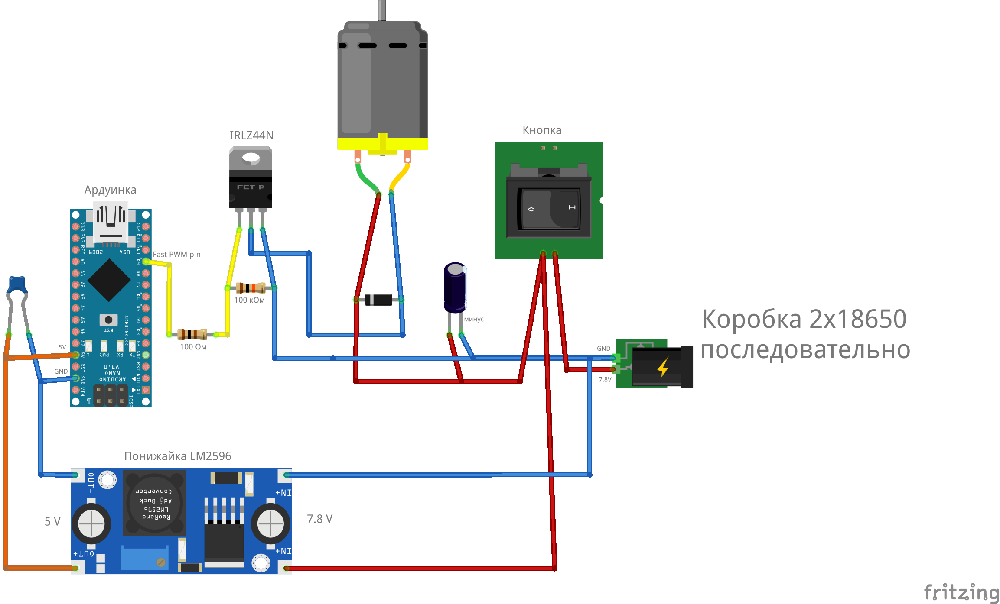

# Проект Вращение радарного полотна модели ВВО 96Л6Е

## Постановка задачи

Необходимо разработать устройство вращения радарного полотна масштабной модели ВВО.

### Параметры устройства вращения:

Целевая скорость вращения: 

|Режим А|Режим Б|
|:---|:---|
|6 обр/мин|10 обр/мин|

## Выбор мотора

Мотор выбран по минимальной скорости вращения:

[12GA-N20/DC 6V/15rpm](https://aliexpress.ru/item/4001195504462.html?sku_id=12000050915181626&spm=a2g2w.productlist.search_results.4.6b513142jFHrQK)

## Вращение оси мотора с заданной угловой скоростью


Скорость вращения вала  - 15 обр/мин (RPM)

Значит нужна схема управления вращением мотора.

**Управление через ШИМ**  
Эффективный диапазон регулирования ≈ 45–100 %  
Рабочая зона:  
```math
15×(0,45…1,00)=6,7…15 (обр/мин)
```
| ШИМ   | RPM     |
| ----- | ------- |
| ~45 % | ~7      |
| ~65 % | ~10     |

По мимо контроллера с возможностью программирования необходим драйвер для безопасной работы двигателя.  

## Драйвер

Для работы двигателя выбран драйвер [DRV8833](https://aliexpress.ru/item/1005006983040834.html?sku_id=12000038938840341&spm=a2g2w.productlist.search_results.1.2061687dVHRCE5) на микросхеме [TB6612](https://know.smartelements.ru/main:motors:tb6612)

## Электрическая схема




## Питание

Питание выбрано через последовательно соединённых [два аккумулятора 18650](https://aliexpress.ru/item/1005009825939421.html?spm=a2g2w.cart.cart_split.14.3dea4aa67HUFB6&sku_id=12000050290104838), в качестве слота хранения батареи [вот такой бокс](https://aliexpress.ru/item/1005002752229071.html?spm=a2g2w.cart.cart_split.10.3dea4aa67HUFB6&sku_id=12000021965571394).  
Выключатель выбран по максимальному току 1 А.  


Сама ардуинка питаться будет через понижайку [LM2596](https://aliexpress.ru/item/1005009287005847.html?spm=a2g2w.cart.cart_split.12.3dea4aa67HUFB6&sku_id=12000048618359895) до 5 В.


## Моя итоговая конфигурация  


2×18650  
   │  
  ключ  
   │  
   ├── DRV8833 → мотор  
   │  
   └── LM2596 → 5V → Arduino  

## Дополнительые компоненты

На обкладки двигателя необходим керамический конденсатор 0.1 мкФ.  
По питанию 470 мкФ электролит.

## Покупные изделия

|Компонент|Кол-во, шт|Название + ссылка|Примерная стоимость, руб|
|-----|-----|-----|-----|
|Мотор|	1	|[12GA-N20/DC 6V/15rpm](https://aliexpress.ru/item/4001195504462.html?sku_id=12000050915181626&spm=a2g2w.productlist.search_results.4.6b513142jFHrQK)	|230|
|Ардуино|	1	|[Arduino Nano V3.0](https://aliexpress.ru/item/1005006773519913.html?spm=a2g2w.cart.cart_split.2.da564aa6lc5Gta&sku_id=12000038256018928)	|166|
|Провода сигнальные	|15	|[Dupont](https://aliexpress.ru/item/1005001621943322.html?spm=a2g2w.cart.cart_split.4.da564aa6lc5Gta&sku_id=12000016846728384)	|184|
|Провод силовой	|1|	[12 AWG](https://aliexpress.ru/item/1005006106389362.html?spm=a2g2w.cart.cart_split.2.48334aa6tyhPe2&sku_id=12000035836360979)	|220|
|Кондёр керамика 0.1 мкФ|	3|	[100nF 50V](https://aliexpress.ru/item/1_91432155.html?spm=a2g2w.cart.cart_split.10.da564aa6lc5Gta&sku_id=5000000174034026)	|267,22|
|Кондёр электролит 470 мкФ|	1	|[470uF](https://aliexpress.ru/item/1005002075527957.html?spm=a2g2w.cart.cart_split.12.da564aa6lc5Gta&sku_id=12000018654903097)	|156|
|Переключатель|	1	|[KCD11-101](https://aliexpress.ru/item/1005004124751042.html?spm=a2g2w.cart.cart_split.14.da564aa6lc5Gta&sku_id=12000028117593060)	|38|
|Бокс для батарей	|1|	[вот такой бокс](https://aliexpress.ru/item/1005002752229071.html?spm=a2g2w.cart.cart_split.10.3dea4aa67HUFB6&sku_id=12000021965571394)	|59|
|Аккумуляторы 2 шт	|1|	[два аккумулятора 18650](https://aliexpress.ru/item/1005009825939421.html?spm=a2g2w.cart.cart_split.14.3dea4aa67HUFB6&sku_id=12000050290104838)	|1039|
|Понижайка	|1|	[LM2596](https://aliexpress.ru/item/1005009287005847.html?spm=a2g2w.cart.cart_split.12.3dea4aa67HUFB6&sku_id=12000048618359895)	|48|
|Драйвер мотора	|1|	[DRV8833](https://aliexpress.ru/item/1005006983040834.html?sku_id=12000038938840341&spm=a2g2w.productlist.search_results.1.2061687dVHRCE5)	|184|

Сумма: 2591,22 руб  
Доставка: 678 руб  

ИТОГО: **3278,22** руб  

